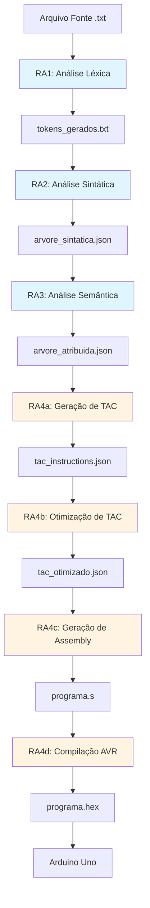

# Arquitetura do Compilador - Visão Completa

## Índice

1. [Visão Geral](#visão-geral)
2. [Pipeline de Compilação](#pipeline-de-compilação)
3. [Mapeamento Teoria-para-Código](#mapeamento-teoria-para-código)
4. [Fluxo de Dados Entre Fases](#fluxo-de-dados-entre-fases)
5. [Preocupações Transversais](#preocupações-transversais)
6. [Estrutura de Diretórios](#estrutura-de-diretórios)

---

## Visão Geral

Este compilador implementa um **processador completo de 4 fases** para uma linguagem baseada em **Notação Polonesa Reversa (RPN)** com sintaxe prefixada entre parênteses. O alvo é o microcontrolador **Arduino Uno (ATmega328P)**.

### Características Principais

- **Linguagem Fonte**: Notação RPN com formato `(operando1 operando2 operador)`
- **Arquitetura Alvo**: AVR 8-bit (ATmega328P)
- **Precisão Numérica**: Inteiros de 16 bits + reais de meia precisão (IEEE 754)
- **Código Intermediário**: Three Address Code (TAC)
- **Otimizações**: 4 técnicas clássicas (folding, propagation, dead code, jumps)

---

## Pipeline de Compilação



### Descrição das Fases

#### Fase 1: Análise Léxica (RA1)
**Entrada**: Código fonte em texto plano
**Saída**: `outputs/RA1/tokens/tokens_gerados.txt`
**Função**: Tokenização caractere-por-caractere

**O que faz**:
- Lê o arquivo de entrada linha por linha
- Identifica tokens: números, operadores, parênteses, palavras-chave
- Classifica cada token (inteiro, real, operador, variável, etc.)
- Gera lista sequencial de tokens para a próxima fase

**Arquivo principal**: `src/RA1/functions/python/analisador_lexico.py`

---

#### Fase 2: Análise Sintática (RA2)
**Entrada**: `tokens_gerados.txt`
**Saída**: `outputs/RA2/arvore_sintatica.json`
**Função**: Parser LL(1) com geração de AST

**O que faz**:
- Valida se os tokens seguem a gramática da linguagem
- Constrói tabela LL(1) (conjuntos FIRST/FOLLOW)
- Usa parser descendente preditivo (stack-based)
- Gera Árvore Sintática Abstrata (AST)

**Arquivos principais**:
- `calcularFirst.py` - Calcula conjunto FIRST
- `calcularFollow.py` - Calcula conjunto FOLLOW
- `construirTabelaLL1.py` - Constrói tabela de parsing
- `parsear.py` - Parser descendente preditivo
- `gerarArvore.py` - Construtor da AST

---

#### Fase 3: Análise Semântica (RA3)
**Entrada**: `arvore_sintatica.json`
**Saída**: `outputs/RA3/arvore_atribuida.json` + relatórios
**Função**: Verificação de tipos e validação semântica

**O que faz** (3 sub-fases):
1. **Verificação de Tipos**: Infere e valida tipos (int, real, boolean)
2. **Análise de Memória**: Verifica inicialização de variáveis
3. **Análise de Controle**: Valida estruturas WHILE/IF/FOR

**Saídas adicionais**:
- `julgamento_tipos.md` - Decisões de tipagem
- `tabela_simbolos.md` - Tabela de símbolos
- `erros_semanticos.md` - Erros encontrados (se houver)

**Arquivos principais**:
- `analisador_tipos.py` - Inferência e verificação de tipos
- `tabela_simbolos.py` - Gerenciamento da tabela de símbolos
- `analisador_memoria_controle.py` - Validação de memória e controle

---

#### Fase 4a: Geração de TAC (RA4)
**Entrada**: `arvore_atribuida.json`
**Saída**: `outputs/RA4/tac_instructions.json`
**Função**: Conversão AST → TAC

**O que faz**:
- Percorre a AST em pós-ordem
- Gera instruções de três endereços
- Cria variáveis temporárias (t0, t1, t2, ...)
- Cria labels para controle de fluxo (L0, L1, L2, ...)

**Arquivo principal**: `src/RA4/functions/python/gerador_tac.py`

---

#### Fase 4b: Otimização de TAC (RA4)
**Entrada**: `tac_instructions.json`
**Saída**: `outputs/RA4/tac_otimizado.json` + relatório
**Função**: Otimização multi-passo

**O que faz** (4 técnicas):
1. **Constant Folding**: Avalia expressões constantes
2. **Constant Propagation**: Substitui variáveis constantes
3. **Dead Code Elimination**: Remove código não utilizado
4. **Jump Elimination**: Remove saltos redundantes

**Algoritmo**: Iterativo até convergência (ponto fixo)

**Arquivo principal**: `src/RA4/functions/python/otimizador_tac.py`

---

#### Fase 4c: Geração de Assembly (RA4)
**Entrada**: `tac_otimizado.json`
**Saída**: `outputs/RA4/*.s` (Assembly AVR)
**Função**: Tradução TAC → Assembly

**O que faz**:
- Aloca registradores AVR para variáveis
- Traduz instruções TAC para mnemonics AVR
- Gerencia registradores de 16 bits (pares)
- Implementa operações aritméticas/lógicas

**Arquivo principal**: `src/RA4/functions/python/gerador_assembly.py`

---

#### Fase 4d: Compilação e Upload (RA4)
**Entrada**: `*.s` (Assembly)
**Saída**: `*.hex` (firmware)
**Função**: Compilação AVR e upload para Arduino

**O que faz**:
- Detecta ferramentas AVR (avr-gcc, avrdude)
- Compila `.s` → `.elf` → `.hex`
- Detecta porta serial do Arduino
- Faz upload do firmware

**Arquivo principal**: `src/RA4/functions/python/arduino_tools.py`

---

## Mapeamento Teoria-para-Código

### Conceitos de Compiladores → Implementação

| Conceito Teórico | Fase | Arquivo de Implementação | Função Principal | Linhas Chave |
|------------------|------|--------------------------|------------------|--------------|
| **Análise Léxica** | RA1 | `analisador_lexico.py` | `parseExpressao()` | 50-200 |
| Autômato Finito | RA1 | `analisador_lexico.py` | `estado_zero()`, `estado_numero()` | 100-180 |
| Token | RA1 | `tokens.py` | `class Token`, `Tipo_de_Token` | 1-50 |
| **Análise Sintática** | RA2 | | | |
| Gramática Livre de Contexto | RA2 | `configuracaoGramatica.py` | `obter_gramatica()` | 10-100 |
| Conjunto FIRST | RA2 | `calcularFirst.py` | `calcularFirst()` | 15-80 |
| Conjunto FOLLOW | RA2 | `calcularFollow.py` | `calcularFollow()` | 15-90 |
| Tabela LL(1) | RA2 | `construirTabelaLL1.py` | `construirTabelaLL1()` | 20-100 |
| Parser Descendente | RA2 | `parsear.py` | `parsear()` | 50-200 |
| AST | RA2 | `gerarArvore.py` | `gerarArvore()` | 30-150 |
| **Análise Semântica** | RA3 | | | |
| Sistema de Tipos | RA3 | `tipos.py` | `promover_tipo()` | 10-50 |
| Tabela de Símbolos | RA3 | `tabela_simbolos.py` | `class TabelaSimbolos` | 1-100 |
| Inferência de Tipos | RA3 | `analisador_tipos.py` | `inferir_tipo()` | 80-300 |
| Verificação Semântica | RA3 | `analisador_semantico.py` | `analisarSemantica()` | 50-200 |
| **Geração de Código** | RA4 | | | |
| Código Intermediário (TAC) | RA4 | `gerador_tac.py` | `gerarTAC()` | 100-400 |
| Instruções TAC | RA4 | `tac_instructions.py` | Classes de instruções | 1-200 |
| Otimização | RA4 | `otimizador_tac.py` | `class TACOptimizer` | 50-500 |
| Constant Folding | RA4 | `otimizador_tac.py` | `_aplicar_constant_folding()` | 150-250 |
| Constant Propagation | RA4 | `otimizador_tac.py` | `_aplicar_constant_propagation()` | 260-350 |
| Dead Code Elimination | RA4 | `otimizador_tac.py` | `_aplicar_dead_code_elimination()` | 360-450 |
| Alocação de Registradores | RA4 | `gerador_assembly.py` | `_alocar_registrador()` | 200-350 |
| Geração de Assembly | RA4 | `gerador_assembly.py` | `gerar()` | 50-1400 |

---

## Fluxo de Dados Entre Fases

### Estruturas de Dados em Cada Fronteira

#### RA1 → RA2: Tokens

**Formato**: Arquivo texto com tokens separados por espaços

```
Linha 1: (  1  COUNTER  )
Linha 2: (  8  LIMIT  )
```

**Estrutura de dados**:
```python
class Token:
    tipo: Tipo_de_Token  # NUMERO_INTEIRO, VARIAVEL, SOMA, etc.
    valor: str           # "1", "COUNTER", "+", etc.
```

---

#### RA2 → RA3: AST

**Formato**: JSON com estrutura de árvore

```json
{
  "linhas": [
    {
      "numero_linha": 1,
      "arvore": {
        "label": "LINHA",
        "filhos": [
          {"label": "(", "filhos": []},
          {"label": "1", "filhos": []},
          {"label": "COUNTER", "filhos": []},
          {"label": ")", "filhos": []}
        ]
      },
      "tokens": ["(", "1", "COUNTER", ")"]
    }
  ]
}
```

**Estrutura**: Árvore hierárquica com nós não-terminais e folhas (tokens)

---

#### RA3 → RA4: Árvore Atribuída

**Formato**: JSON com AST + anotações de tipo

```json
{
  "arvore_atribuida": [
    {
      "tipo_vertice": "LINHA",
      "numero_linha": 1,
      "tipo": "int",
      "filhos": [
        {
          "tipo_vertice": "ARITH_OP",
          "operador": "+",
          "tipo": "int",
          "filhos": [
            {
              "subtipo": "numero_inteiro",
              "valor": "5",
              "tipo": "int"
            },
            {
              "subtipo": "numero_inteiro",
              "valor": "3",
              "tipo": "int"
            }
          ]
        }
      ]
    }
  ]
}
```

**Adições**: Campo `"tipo"` em cada nó (int, real, boolean)

---

#### RA4a → RA4b: TAC Original

**Formato**: JSON com lista de instruções

```json
{
  "instructions": [
    {
      "type": "assignment",
      "dest": "COUNTER",
      "source": "1",
      "line": 1,
      "data_type": "int"
    },
    {
      "type": "binary_op",
      "result": "t0",
      "operand1": "5",
      "operator": "+",
      "operand2": "3",
      "line": 2,
      "data_type": "int"
    }
  ]
}
```

**Estrutura**: Sequência linear de instruções de três endereços

---

#### RA4b → RA4c: TAC Otimizado

**Formato**: Mesmo que TAC original, porém com:
- Menos instruções (código morto removido)
- Expressões constantes avaliadas
- Saltos redundantes eliminados

**Exemplo de otimização**:
```
ANTES:              DEPOIS:
t0 = 2              t0 = 5
t1 = 3              RESULT = t0
t2 = t0 + t1
RESULT = t2
```

---

#### RA4c → RA4d: Assembly AVR

**Formato**: Arquivo `.s` com mnemonics AVR

```asm
; TAC: COUNTER = 1
ldi r16, 1          ; Carrega 1 em R16
sts COUNTER, r16    ; Armazena R16 em COUNTER

; TAC: t0 = 5 + 3
ldi r16, 5          ; Carrega 5
ldi r17, 3          ; Carrega 3
add r16, r17        ; Soma
sts t0, r16         ; Armazena resultado
```

---

## Preocupações Transversais

### 1. Propagação de Tipos Através das Fases

**Fluxo de informação de tipo**:

```
RA1: Não há tipos (apenas tokens)
  ↓
RA2: Não há tipos (apenas estrutura sintática)
  ↓
RA3: TIPOS INFERIDOS E ANOTADOS
  ↓ (cada nó da AST agora tem campo "tipo")
RA4: TIPOS USADOS para gerar código correto
```

**Exemplo**:
- `(5 3.0 +)`
- RA3 detecta: `int + real` → promove para `real`
- RA4 gera: Instruções para aritmética de ponto flutuante

---

### 2. Tratamento de Erros em Cada Fase

| Fase | Tipo de Erro | Exemplo | Como é Reportado |
|------|--------------|---------|------------------|
| RA1 | Léxico | Caractere inválido `@` | Erro na tokenização |
| RA2 | Sintático | `(5 +)` (operando faltando) | Erro no parser |
| RA3 | Semântico | `(5 "texto" +)` (tipos incompatíveis) | `erros_semanticos.md` |
| RA4 | Geração | Instrução TAC não implementada | Exceção em runtime |

**Filosofia**: Falhar rápido (fail-fast) - parar na primeira fase que detecta erro

---

### 3. Evolução das Estruturas de Dados

```
TEXTO
  "( 5 3 + )"
    ↓ RA1
TOKENS
  [ABRE_PAREN, NUMERO_INT(5), NUMERO_INT(3), SOMA, FECHA_PAREN]
    ↓ RA2
AST (árvore)
  LINHA
  ├── (
  ├── ARITH_OP(+)
  │   ├── 5
  │   └── 3
  └── )
    ↓ RA3
AST ATRIBUÍDA (árvore com tipos)
  LINHA [tipo: int]
  ├── (
  ├── ARITH_OP(+) [tipo: int]
  │   ├── 5 [tipo: int]
  │   └── 3 [tipo: int]
  └── )
    ↓ RA4a
TAC (código linear)
  t0 = 5 + 3
    ↓ RA4b
TAC OTIMIZADO
  t0 = 8
    ↓ RA4c
ASSEMBLY
  ldi r16, 8
  sts t0, r16
```

---

### 4. Gerenciamento de Temporários e Labels

**RA4 mantém contadores globais**:

```python
class TACManager:
    temp_counter = 0
    label_counter = 0

    def new_temp():
        temp = f"t{temp_counter}"
        temp_counter += 1
        return temp

    def new_label():
        label = f"L{label_counter}"
        label_counter += 1
        return label
```

**Usado em**:
- Geração de TAC: criar `t0, t1, t2, ...`
- Estruturas de controle: criar `L0, L1, L2, ...`

---

## Estrutura de Diretórios

```
RA4_1/
├── compilador.py              # ORQUESTRADOR PRINCIPAL
│
├── src/                       # Código fonte (4 fases)
│   ├── RA1/functions/python/
│   │   ├── analisador_lexico.py    # Tokenizador
│   │   ├── tokens.py                # Tipos de token
│   │   ├── rpn_calc.py              # Parser de expressões
│   │   └── io_utils.py              # Utilitários I/O
│   │
│   ├── RA2/functions/python/
│   │   ├── configuracaoGramatica.py # Definição da gramática
│   │   ├── calcularFirst.py         # Conjunto FIRST
│   │   ├── calcularFollow.py        # Conjunto FOLLOW
│   │   ├── construirTabelaLL1.py    # Tabela LL(1)
│   │   ├── parsear.py               # Parser
│   │   └── gerarArvore.py           # Gerador de AST
│   │
│   ├── RA3/functions/python/
│   │   ├── tipos.py                       # Sistema de tipos
│   │   ├── tabela_simbolos.py             # Tabela de símbolos
│   │   ├── analisador_tipos.py            # Verificador de tipos
│   │   ├── analisador_memoria_controle.py # Validação memória/controle
│   │   ├── gerador_arvore_atribuida.py    # Gerador AST atribuída
│   │   └── analisador_semantico.py        # Orquestrador RA3
│   │
│   └── RA4/functions/python/
│       ├── gerador_tac.py           # Gerador TAC
│       ├── otimizador_tac.py        # Otimizador TAC
│       ├── tac_instructions.py      # Definições de instruções
│       ├── tac_manager.py           # Gerenciador temps/labels
│       ├── ast_traverser.py         # Travessia da AST
│       ├── gerador_assembly.py      # Gerador Assembly
│       ├── arduino_tools.py         # Ferramentas AVR
│       └── upload_arduino.py        # Upload para Arduino
│
├── inputs/                    # Arquivos de teste
│   └── RA4/
│       ├── fatorial.txt       # Teste 1: Fatorial
│       ├── fibonacci.txt      # Teste 2: Fibonacci
│       └── taylor.txt         # Teste 3: Série de Taylor
│
├── outputs/                   # Saídas geradas
│   ├── RA1/tokens/
│   │   └── tokens_gerados.txt
│   ├── RA2/
│   │   └── arvore_sintatica.json
│   ├── RA3/
│   │   ├── arvore_atribuida.json
│   │   └── relatorios/
│   │       ├── arvore_atribuida.md
│   │       ├── julgamento_tipos.md
│   │       ├── tabela_simbolos.md
│   │       └── erros_semanticos.md
│   └── RA4/
│       ├── tac_instructions.json
│       ├── tac_output.md
│       ├── tac_otimizado.json
│       ├── tac_otimizado.md
│       ├── *.s (assembly)
│       ├── *.hex (firmware)
│       └── relatorios/
│           └── otimizacao_tac.md
│
└── docs/                      # Documentação
    ├── RA4/
    │   └── convencoes_registradores.md
    └── materiais_estudo/      # MATERIAIS EDUCACIONAIS
        └── (este documento)
```

---

## Perguntas Frequentes da Defesa

### P1: "Como as fases se comunicam?"

**R**: Através de arquivos JSON e texto estruturados:
- RA1 → RA2: `tokens_gerados.txt` (formato texto)
- RA2 → RA3: `arvore_sintatica.json` (AST)
- RA3 → RA4: `arvore_atribuida.json` (AST com tipos)
- RA4a → RA4b: `tac_instructions.json` (TAC)

Cada fase lê a saída da anterior, processa, e gera nova saída.

---

### P2: "Onde a informação de tipo é adicionada?"

**R**: Na **RA3 (Análise Semântica)**:
- Função: `analisador_tipos.py::inferir_tipo()`
- Método: Travessia bottom-up da AST
- Resultado: Campo `"tipo"` em cada nó

Exemplo:
```json
{
  "tipo_vertice": "ARITH_OP",
  "operador": "+",
  "tipo": "real",  ← ADICIONADO EM RA3
  "filhos": [...]
}
```

---

### P3: "Como o compilador sabe qual registrador usar?"

**R**: Na **RA4c (Geração de Assembly)**:
- Arquivo: `gerador_assembly.py`
- Função: `_alocar_registrador()`
- Estratégia: Alocação fixa + pool de temporários
  - Variáveis conhecidas: Registradores fixos
  - Temporários: R24-R25 (reutilizados)
  - Spilling: Se necessário, usa memória

---

## Próximos Passos

Para entender em profundidade:
1. Leia **RA2_LL1_GUIA_COMPLETO.md** para entender parsing
2. Leia **RA4_OTIMIZACAO_TAC.md** para entender otimizações
3. Leia os walkthroughs de cada fase (RA1-RA4)
4. Estude **PERGUNTAS_DEFESA.md** para questões típicas

---

**Última atualização**: 2025-01-27
