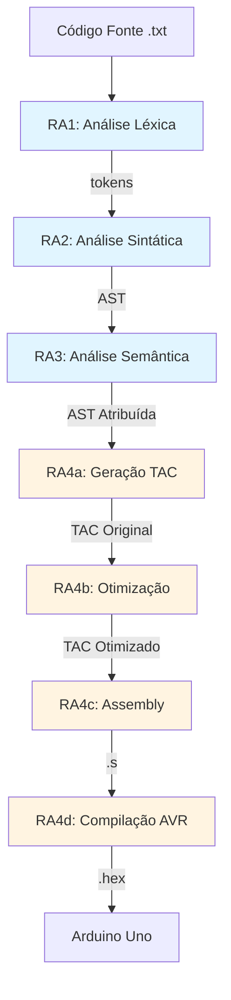
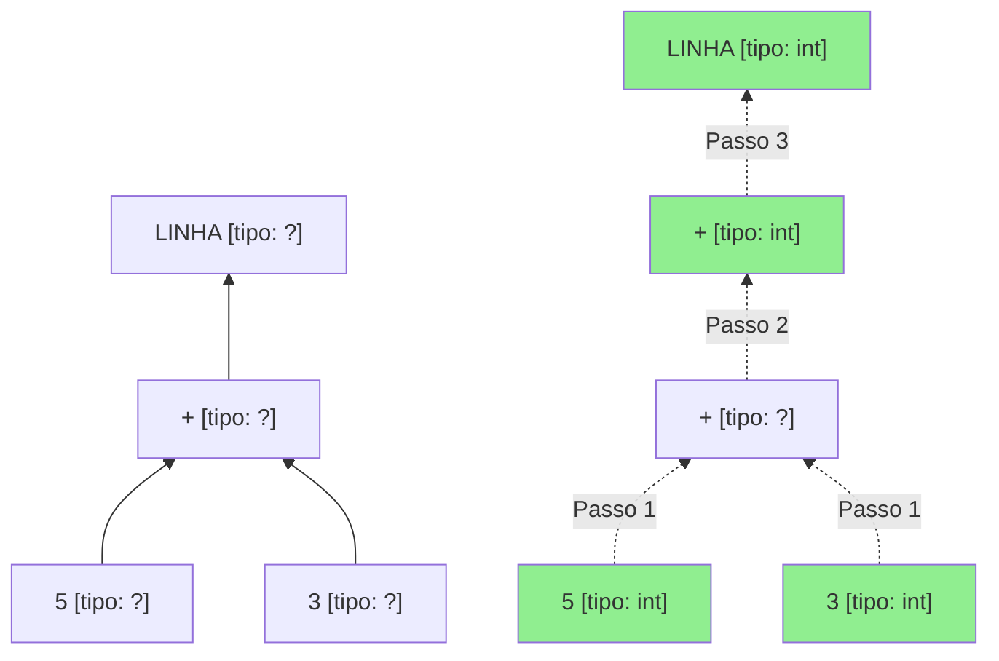
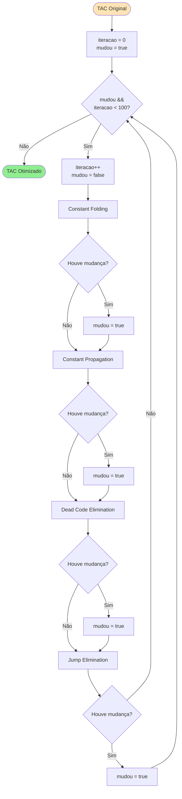
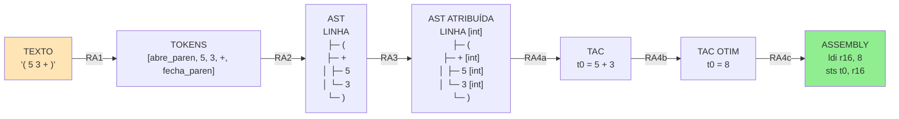
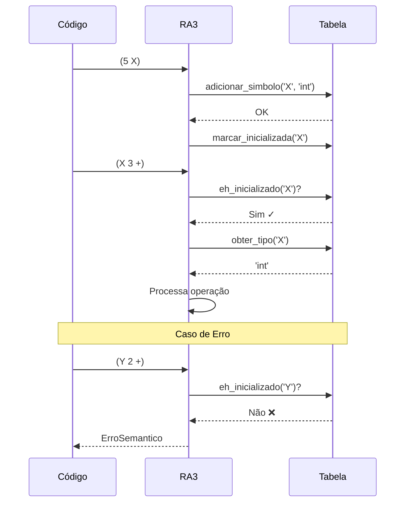
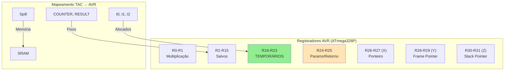
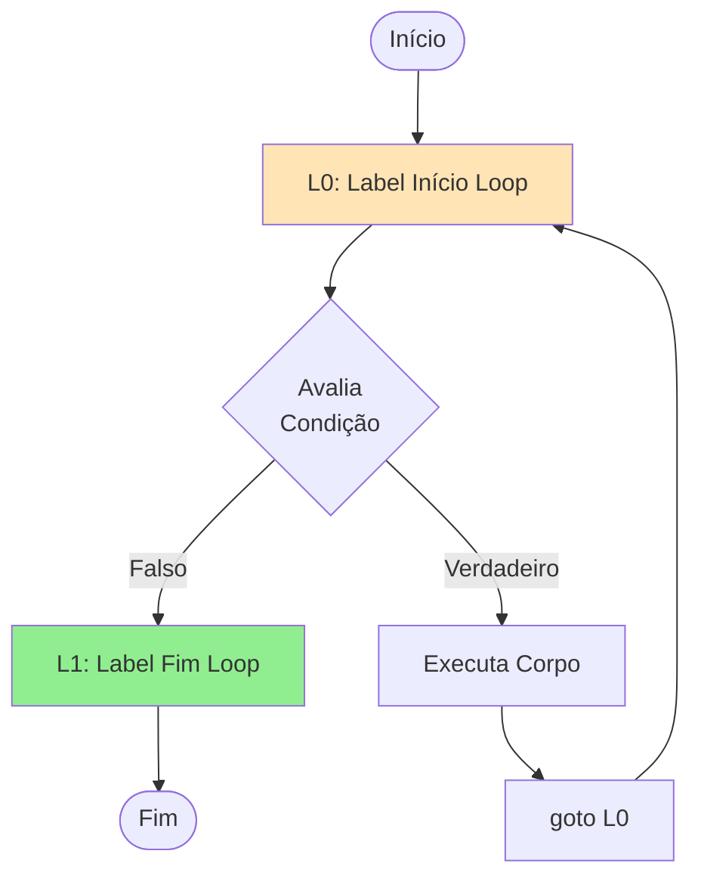
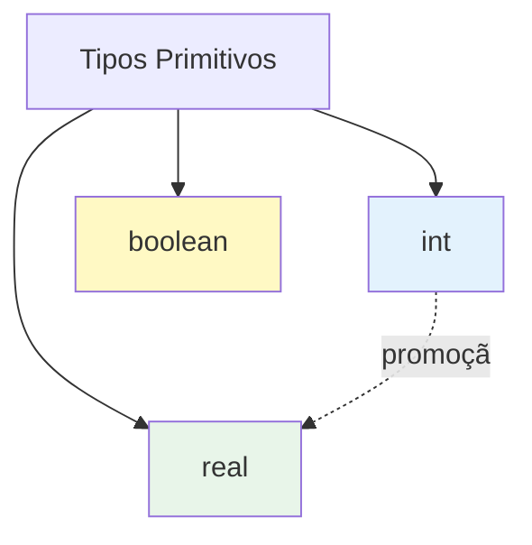
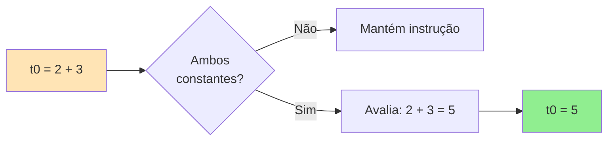

# Diagramas Visuais do Compilador

Todos os diagramas em formato **Mermaid** (renderiza em GitHub/VS Code).

---

## 1. Pipeline Completo



---

## 2. Algoritmo LL(1) Parsing

```mermaid
flowchart TD
    START([Início]) --> INIT[Inicializa Pilha = $, PROGRAM<br/>Entrada = tokens + $]
    INIT --> LOOP{Pilha vazia?}
    LOOP -->|Sim| SUCCESS([Aceito ✓])
    LOOP -->|Não| POP[Remove topo da pilha]
    POP --> CHECK{Topo é<br/>terminal?}

    CHECK -->|Sim| MATCH{topo == entrada?}
    MATCH -->|Sim| ADVANCE[Avança entrada]
    ADVANCE --> LOOP
    MATCH -->|Não| ERROR1([Erro Sintático])

    CHECK -->|Não| TABLE[Consulta M[topo, entrada]]
    TABLE --> FOUND{Produção<br/>encontrada?}
    FOUND -->|Não| ERROR2([Erro Sintático])
    FOUND -->|Sim| EXPAND[Empilha símbolos<br/>da produção]
    EXPAND --> LOOP

    style SUCCESS fill:#90EE90
    style ERROR1 fill:#FFB6C1
    style ERROR2 fill:#FFB6C1
```

---

## 3. Verificação de Tipos (Bottom-Up)



---

## 4. Otimização Multi-Pass



---

## 5. Evolução das Estruturas de Dados



---

## 6. Tabela de Símbolos - Ciclo de Vida



---

## 7. Alocação de Registradores AVR



---

## 8. Fluxo de Controle: WHILE



**TAC correspondente**:
```
L0:
    t0 = COUNTER <= LIMIT
    ifFalse t0 goto L1
    ... (corpo)
    goto L0
L1:
```

---

## 9. Hierarquia de Tipos



**Regras**:
- `int` pode ser promovido para `real`
- `boolean` não tem conversão automática
- Operadores relacionais sempre retornam `boolean`

---

## 10. Constant Folding - Fluxo



---

## Como Usar os Diagramas

### No GitHub/VS Code
Os diagramas Mermaid renderizam automaticamente.

### Em Apresentações
1. Copie código Mermaid
2. Use https://mermaid.live para gerar PNG
3. Insira em slides

### Para Estudo
- Trace fluxos manualmente
- Adicione exemplos concretos
- Compare com código real

---

**Dica**: Desenhe esses diagramas à mão durante a defesa para mostrar compreensão!
